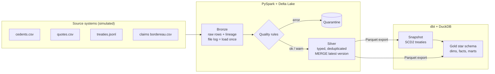

# Reinsurance Lakehouse


A daily data pipeline for reinsurance **treaty, quote and claims** data, built with **PySpark, Delta Lake and dbt**. It takes messy files from insurance companies, catches bad data, handles late and revised records, and produces tested reporting tables that answer two business questions:

1. **Is each treaty making or losing money?** Loss ratio = incurred losses ÷ premium, in USD.
2. **How many of our quotes do we win?** Hit ratio = bound quotes ÷ decided quotes, by cedent, line of business and month.

> **About the data:** real treaty data is confidential, so `src/relake/generate.py` simulates four source systems. It deliberately adds the problems real feeds have: duplicate rows, typos in codes, missing IDs, negative amounts, impossible dates, claims for treaties that haven't arrived yet, and files delivered days late.

## How it works, in plain words

Every day, insurance companies (cedents) send a reinsurer files: quote requests, the treaties that were agreed, and claims (loss bordereaux). The pipeline turns them into numbers finance and risk teams can trust:

1. **Files arrive** in dated folders — messy, sometimes duplicated, sometimes late.
2. **Bronze** copies each new file in exactly once, unchanged, and records which files it has already loaded. Re-running never creates duplicates, and a late file is still picked up.
3. **Quality checks** test every row. Bad rows go to a **quarantine** table with the reason. If too much of a batch is bad, the run **stops** before the reports are touched.
4. **Silver** cleans the data, removes duplicates and keeps only the **newest version** of each record, so a late or repeated file can never overwrite newer data.
5. **Gold (dbt)** builds the reporting tables: treaty history, claims and quotes facts, and the **loss ratio** and **hit ratio** reports, each checked by automated data tests.
6. **Every push to GitHub** re-runs all tests and a 5-day pipeline run automatically (the green badge above).

## Architecture



| Layer | What it holds | Key technique |
| --- | --- | --- |
| Landing | Daily files per source in `ingest_date=YYYY-MM-DD/` folders | — |
| Bronze | Every row as delivered (all text), plus `_source_file`, `_ingest_date`, `_ingested_at`, `_run_id` | File log makes loads incremental and safe to re-run |
| Silver | One current row per record, typed and cleaned | Quality rules, quarantine, deduplication, Delta `MERGE` where only newer versions win |
| Gold | `dim_treaty` (SCD Type 2), `dim_cedent`, `dim_date`, `dim_line_of_business`, `fact_claim`, `fact_quote`, `mart_treaty_loss_ratio`, `mart_quote_hit_ratio` | dbt models, snapshot and 30+ data tests |

## Data model (gold)

| Table | Grain (one row per…) | Used for |
| --- | --- | --- |
| `fact_claim` | claim, latest version | Paid, reserve and incurred amounts in USD |
| `fact_quote` | quote, latest status | Quoted premium, bound / declined |
| `dim_treaty` | treaty **version** (SCD Type 2) | Treaty terms as they were on any date; `is_current` for today |
| `dim_cedent` | cedent | Insurer name and country |
| `dim_date` | calendar day | Year, quarter, month |
| `mart_treaty_loss_ratio` | treaty | Incurred ÷ premium |
| `mart_quote_hit_ratio` | cedent × line of business × month | Bound ÷ (bound + declined) |

More detail and a diagram: [docs/data_model.md](docs/data_model.md).

## What it handles, and how

| Real-world problem | Where | How |
| --- | --- | --- |
| Same file delivered twice, or pipeline re-run | Bronze | File log: each file loads once |
| File arrives days late into an old folder | Bronze | Files are found by name, not by date, so it's picked up on the next run |
| Exact duplicate rows | Silver | `dropDuplicates` on business columns |
| Several versions of the same record | Silver | Keep the latest `updated_at` per key |
| Older version arrives after a newer one | Silver | `MERGE ... WHEN MATCHED AND s.updated_at > t.updated_at` |
| Missing IDs, negative amounts, impossible dates, unknown currency | Silver | Error rules: row goes to quarantine with the failed rule |
| Messy codes (`"  usd "`, `Casualty`) | Silver | Trim and upper-case before validating |
| Whole feed broken | Silver | Run stops if >5% of a batch fails (and ≥5 rows); silver untouched |
| Claim arrives before its treaty | Silver + dbt | Kept and tagged `treaty_not_yet_known`; excluded from loss ratios until the treaty arrives |
| Treaty terms change mid-term | dbt | Snapshot keeps full SCD Type 2 history |
| Reprocessing a past period | CLI | `relake backfill --start --end`, safe to repeat |

Why each choice was made: [docs/decisions.md](docs/decisions.md).

## Results

Run: 10 simulated business days (`relake simulate --days 10 --with-dbt`, scale 1.0) in GitHub Codespaces. CI runs a 5-day version on every push.

Last three days of the run log (`relake status`):

| Date | Feed | Rows landed (bronze) | Merged into silver | Quarantined | Removed as duplicates |
| --- | --- | --- | --- | --- | --- |
| 2026-01-08 | claims | 327 | 315 | 6 (1.8%) | 6 |
| 2026-01-08 | quotes | 230 | 225 | 0 | 5 |
| 2026-01-08 | treaties | 38 | 38 | 0 | 0 |
| 2026-01-09 | claims | 335 | 327 | 5 (1.5%) | 3 |
| 2026-01-09 | quotes | 224 | 222 | 1 (0.4%) | 1 |
| 2026-01-09 | treaties | 32 | 32 | 0 | 0 |
| 2026-01-10 | claims | 334 | 324 | 4 (1.2%) | 6 |
| 2026-01-10 | quotes | 211 | 203 | 1 (0.5%) | 7 |
| 2026-01-10 | treaties | 33 | 32 | 0 | 1 |

What this shows:

- **Bad data is caught, not loaded:** 1–2% of claims fail error rules each day and go to quarantine with the reason recorded. No day came close to the 5% halt threshold.
- **Duplicates never reach silver:** re-sent rows and multiple versions collapse to one current row per record before the MERGE.
- **Loads are incremental:** reference data (cedents) arrives once; every later run reports `NO_NEW_DATA` instead of reloading it.
- **Re-runs and backfills are safe:** re-running a day or backfilling a range leaves silver unchanged (checked by the end-to-end test).
- **Reports are tested:** dbt rebuilds the star schema and reports after every day, with all data tests passing.

## Run it yourself

Easiest: open this repo in **GitHub Codespaces** (Code → Codespaces → Create). Python, Java and all packages install automatically.

```bash
make test                               # unit + end-to-end tests
relake simulate --days 14 --with-dbt    # 14 business days: generate, load, build reports
relake status                           # row counts per layer and recent runs
make docs                               # dbt lineage graph in the browser
```

Other commands:

```bash
relake generate --date 2026-01-15       # one day of source files
relake run --date 2026-01-15            # load new files: bronze -> silver
relake backfill --start 2026-01-03 --end 2026-01-05
relake dbt                              # silver -> gold, with tests
```

Loss ratio by line of business:

```bash
python -c "import duckdb; duckdb.connect('data/warehouse.duckdb').sql('select line_of_business, round(sum(incurred_usd) / sum(premium_usd), 3) as loss_ratio from marts.mart_treaty_loss_ratio group by 1 order by 2 desc').show()"
```

## Project layout

```
conf/pipeline.yml              paths, seed, data volume, quality thresholds
src/relake/generate.py         simulated source systems with injected defects
src/relake/bronze.py           incremental file loading + file log
src/relake/quality.py          rule engine: error -> quarantine, warn -> tag, halt threshold
src/relake/silver.py           clean, validate, deduplicate, MERGE, export
src/relake/run_log.py          one row per feed per run
src/relake/cli.py              generate | run | simulate | backfill | dbt | status
dbt/                           staging, snapshot (SCD2), marts, seeds, tests
orchestration/airflow_dag.py   optional daily schedule with retries and alerts
tests/                         generator, quality, silver and end-to-end tests
docs/                          design decisions and data model
```

## Tech stack

Python · PySpark 3.5 · Delta Lake · dbt (DuckDB adapter) · pytest · GitHub Actions · GitHub Codespaces

## Limitations and next steps

- Runs on one machine; the same PySpark code runs on Databricks by replacing file paths with Unity Catalog tables.
- FX rates are static; a production version would load daily rates and convert at the loss date.
- Volume is small by default (`scale: 1.0` ≈ 600 rows a day across feeds). Raise `scale` in `conf/pipeline.yml` to test larger volumes.
- At 100× the data: partition bronze by `_ingest_date`, cluster silver claims by `treaty_id`, and run dbt on the same engine as Spark (Databricks SQL).
